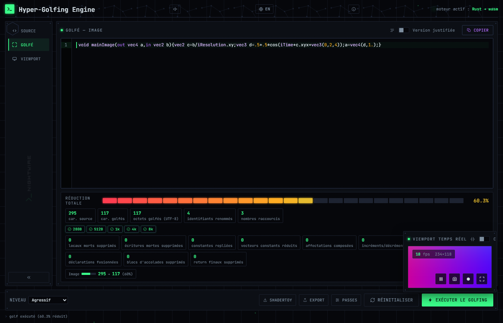

# GLSL Hyper-Golfer

**GLSL shader minifier with a live WebGL preview — 100% in the
browser, nothing is ever sent anywhere.**

Paste a Shadertoy-style shader (a `mainImage` function), get a
minified version in one click, and immediately verify it renders
exactly the same via the built-in viewport.



## 🎮 Try it online

👉 **[Open the app](https://patrickjaillet.github.io/GLSL-Hyper-Golfer/)**

No installation needed — it runs entirely in the browser tab.

## ✨ Why

On Shadertoy, in the demoscene, or any context where code size matters
(280-character "tweetable" shaders, for example), a readable shader
with clear variable names takes up far more space than it needs to
function. Hyper-Golfer shrinks that size automatically:

- **renames** every variable/function/parameter to the shortest name
  available,
- **shortens** numbers (`0.5` → `.5`, `2.0` → `2.`),
- **strips** superfluous whitespace and line breaks,
- and, with aggressive mode enabled, goes further: redundant braces,
  merged declarations, dead code, folded constants...

Every aggressive transformation is *justified*: the risk it introduces
is explained, and you can toggle each pass individually rather than
all-or-nothing.

## 🖥️ How it works

The interface fits on a single screen, no scrolling:

- **Source** — paste your shader here. The "Aggressive golf" level
  enables the optional passes all at once; the "Passes" button lets
  you keep only some of them.
- **Golfed** — the minified result, with the reduction rate and a
  breakdown of what was transformed. The "Formatted view" checkbox
  re-displays the code across multiple lines for easier reading
  (display only — what gets copied and what runs in the viewport
  stays the minified version).
- **Viewport** — real-time WebGL render of the golfed shader, with FPS
  and resolution. The "Compare" checkbox renders the source and golfed
  shaders side by side, to catch a rendering difference that might
  otherwise go unnoticed.

Under a narrow window, the 3 panels automatically switch to tabs. Both
dividers between panels are resizable with the mouse (or the keyboard,
← → arrows).

## 🔒 Privacy

The minification engine runs entirely client-side (compiled to
WebAssembly) — your shader never leaves your browser.

## 🖥️ Running locally

```bash
git clone https://github.com/Patrickjaillet/GLSL-Hyper-Golfer.git
cd GLSL-Hyper-Golfer/web
npm install
npm run dev
```

## 📄 License

[MIT](LICENSE) — free to reuse, modify, and redistribute.

## ℹ️ About

**Hyper-Golfing Engine**
Copyright © 2026 SANDEFJORD DEVELOPMENT — All rights reserved
Creator: Patrick JAILLET
Email: contact.shaderstudio@gmail.com
Website: https://github.com/Patrickjaillet
Repository: https://github.com/Patrickjaillet/GLSL-Hyper-Golfer

Also available in-app, in the "ℹ" panel next to the language toggle.
